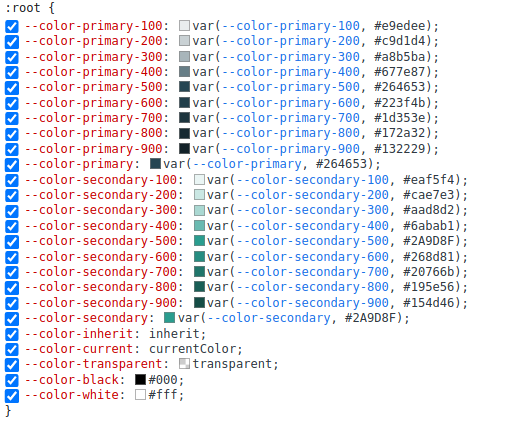

# Palette plugin using CSS variables for TailwindCSS

Adds a color palette (from `100` to `900`) for each color of your tailwind configuration while using CSS variable for each.

This package has been designed to create **library components** where the theme (colors) are easily modifiable in the application, **using CSS variables**.

## Installation

Using yarn :
```bash
yarn add -D tailwindcss-css-variables-palette-plugin
```

Using npm : 
```bash
npm install --save-dev tailwindcss-css-variables-palette-plugin
```

Then set up your `tailwind.config.js` this way :

```
const THEME_COLORS = {
  primary: '#264653',
  secondary: '#2A9D8F'
};

module.exports = {
  /...
  theme: {
    colors: THEME_COLORS,
    extend: {},
  },
  plugins: [
    require('tailwindcss-css-variables-palette-plugin')({
      colors: THEME_COLORS,
    }),
    /...
  ],
};
```

The plugin then create the following configuration for you : 

```
{
  primary: {
    '100': 'var(--color-primary-100, #e9edee)',
    '200': 'var(--color-primary-200, #c9d1d4)',
    '300': 'var(--color-primary-300, #a8b5ba)',
    '400': 'var(--color-primary-400, #677e87)',
    '500': 'var(--color-primary-500, #264653)',
    '600': 'var(--color-primary-600, #223f4b)',
    '700': 'var(--color-primary-700, #1d353e)',
    '800': 'var(--color-primary-800, #172a32)',
    '900': 'var(--color-primary-900, #132229)',
    DEFAULT: 'var(--color-primary, #264653)'
  },
  secondary: {
    '100': 'var(--color-secondary-100, #eaf5f4)',
    '200': 'var(--color-secondary-200, #cae7e3)',
    '300': 'var(--color-secondary-300, #aad8d2)',
    '400': 'var(--color-secondary-400, #6abab1)',
    '500': 'var(--color-secondary-500, #2A9D8F)',
    '600': 'var(--color-secondary-600, #268d81)',
    '700': 'var(--color-secondary-700, #20766b)',
    '800': 'var(--color-secondary-800, #195e56)',
    '900': 'var(--color-secondary-900, #154d46)',
    DEFAULT: 'var(--color-secondary, #2A9D8F)'
  },
}
```

The plugin is also adding the always needed following classes by default (same naming as default TailwindCSS properties) : 

```
{
  inherit: 'inherit',
  current: 'currentColor',
  transparent: 'transparent',
  black: '#000',
  white: '#fff',
}
```

## Simple Usage

Now in your application, you can use classes like `bg-primary-500` or `bg-primary-800` as usual.

`DEFAULT` is the variable used to generate `bg-primary` without suffix.

```html
<span class="bg-primary text-secondary-400">
    Hello !
</span>
```

> NOTE : `primary` and `primary-500` have the same color attributed. It's a better idea to use it without suffix in your code (ex: `bg-primary`) if the goal is to replace the color globally using its CSS variable.

## CSS Variables usage

### Addition in the DOM 

This plugin uses [the `addBase` utility from `tailwindcss/plugin` package](https://tailwindcss.com/docs/adding-custom-styles#writing-plugins).

So in your DOM, under the `:root` attribute, you can now find all the css variables generated by the plugin :



See more at : https://developer.mozilla.org/en-US/docs/Web/CSS/:root

### Change scoped color in your component

Now, if you need to modify one of the color of a property, you can do it globally or component scoped, using the default Css Variables API.

```
:root {
  --color-primary: #D36060;
}

.my-custom-card {
  --color-primary-300: #C2714F;
  --color-secondary: #E0607E;
}
```

Documentation : https://developer.mozilla.org/en-US/docs/Web/CSS/Using_CSS_custom_properties

# Compatibility

This plugin is based on [CSS Custom Properties](https://developer.mozilla.org/en-US/docs/Web/CSS/--*), which are [not compatible with IE11](https://caniuse.com/#feat=css-variables). You can have partial support for the browsers that do not support them by using a PostCSS plugin that add a fallback for CSS variables, such as [`postcss-css-variables`](https://github.com/MadLittleMods/postcss-css-variables) or [`postcss-custom-properties`](https://github.com/postcss/postcss-custom-properties).

## License

This project is licensed under the [MIT License](/LICENSE).